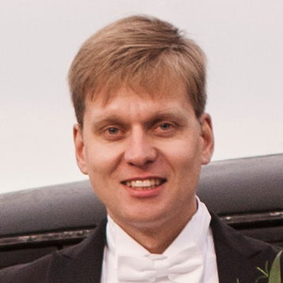

<section class="hero is-primary is-fullheight-with-navbar" style="background: #ffffff url('img/coffee-background.jpg') no-repeat scroll center 40%; background-size: cover;">

  
  

	

      	
      	
		
      	<h1 class="title" style="color: #363636;">Mikko Oikkonen</h1>
      	<h2 class="subtitle" style="color: #363636;">Työnantajan paras ystävä</h2>
    
      	

      		Olen Mikko Oikkonen, ohjelmistotuotannon ammattilainen Tampereelta. Tämä sivu on portfolioni, jossa esittelen työkokemustani ja projektejani. Olen innostunut uusista haasteista ja uuden oppimisesta. Haluaisin mukaan innovatiiviseen tiimiin jossa kehittyisin entistä taitavammaksi ohjelmistokehittäjäksi. Kutsu minut työhaastatteluun!

		

      	 

      	<a href="#yhteystiedot" class="button is-large is-info">Kutsu Mikko työhaastatteluun</a>

    

  
  

</section>

<section id="kokemus" class="hero is-fullheight" style="background: #ffffff;">

  
  

	

      
      	<h1 class="title">Työkokemus</h1>
      	<h2 class="subtitle">Viimeisin työkokemus ohjelmistoalalta</h2>
    

      	

			

				<h3 class="subtitle">{{ job.title }}</h3>
				{{ job.content | markdownify }}

			      	

		

      	<a href="/kokemus" class="button is-large is-success">Näytä lisää</a>

    

  
  

</section>

  

<section class="hero is-primary is-fullheight" style="background: #ffffff url('img/code-background.jpg') no-repeat scroll center 40%; background-size: cover;">

  
	

		

	      	<h1 class="title" style="color: #506C7B;">Projektit</h1>
    	  	<h2 class="subtitle" style="color: #506C7B;">Koodiprojektejani on Githubissa näkyvissä ja niiden avulla voi tutustua tekemisiini...</h2>

			<article class="notification is-primary">
				
Kukko Kevytyrittäjyyssofta

				
Node.js+Vue BackEnd-FrontEnd

				
Webbisofta jossa toteutettu suosittujen kevytyrittäjyyspalvelujen perustoiminnallisuuksia. Käyttäjien rekisteröinti, asiakasrekisteri, laskujen luonti, palkkalaskuri, palkat. Käyttäjät voivat muodostaa laskuja asiakkaille ja nostaa itselleen palkkaa maksettujen laskujen perusteella. Palkanlaskijat voivat merkitä laskuja maksetuksi ja merkitä palkkoja maksetuksi. Frontend-koodi vue.js:llä, joka keskustelee backendin kanssa, joka toteutettu Node.js+Adonis.js:llä.

				<a href="#">Lue lisää</a>
			</article>

			<article class="notification is-primary">
				
NetvisorClient

				
Yhteyspalikka taloushallintaohjelmisto Netvisoriin

				
Taloushallinto-ohjelma Netvisorin ohjelmistorajapintaan JavaSkrirptillä toteuttamani clientti, jolla voi siirtää laskuja, asiakkaita, palkansaajia ja palkkoja Netvisorin ohjelmistorajapinnan kautta. Clientti löytyy npm-pakkauksena ja sen voi liittää omaan Node.js -projektiinsa joka halutaan intekroida taloushallintaohjelmisto Netvisorin kanssa.

				<a href="#">Gitpubbiin</a>
			</article>

			<article class="notification is-primary">
				
Alerent.fi

				
Staattinen nettisivu WordPressillä

				
Halpa-autovuokraamo Alerentin sivut on toteutettu WordPressillä. Sivut ovat kuitenkin niin yksinkertaiset, että niiden on turha olla massiivisen sisällönhallintajärjestelmän päällä. Viritin sivut sellaisiksi, että wp:n asennus ja hallintapaneeli on salaisessa paikassa ja aina kun niitä päivitetään (page/post publish) sivut pullautetaan staattiseksi sivuksi alerent.fi -osoitteeseen. Tämä lisää sivujen nopeutta ja tietoturvaa, koska säilönnänhallintaa tarvitaan vain sivujen päivitysvaiheessa, ei joka kerta kun joku sattuu sivuille surffaamaan.

				<a href="https://www.alerent.fi">alerent.fi</a>
			</article>

			<article class="notification is-primary">
				
Esittelysivu

				
Tämä portfoliosivu Jekyll+Github

				
Tämän portfoliosivuston toteutin Jekyllillä staattisena nettisivuna ja se on hostattuna githubissa. Voin päivittää sivua omalla kotikoneellani ja kun pushaan gitpuppiin, sivut automaagisesti päivittyvät. Hostaus on ilmaista. Https on ilmainen. Maksan vain omasta domainista. Käytin Bulma css-kirjastoa sivun toteutuksessa.

				<a href="#">Esittelysivu</a>
			</article>

   	 	

	

</section>

<section class="section heroi is-fullheighti">

	

		

		  

		    <i class="fas fa-toolbox fa-4x"></i>
		    <h3 class="title">Monipuolinen</h3>
		    
Monipuolista kokemusta kaikista ohjelmistojen elinkaaren vaiheista.

		  

		  

		    <i class="fas fa-users fa-4x"></i>
		    <h3 class="title">Tiimi-yhteensopiva</h3>
		    
Viihdyn parhaiten tiimissä mutta osaan työskennellä myös yksin oma-aloitteisesti.

		  

		  

		    <i class="fas fa-question-circle fa-4x"></i>
		    <h3 class="title">Ympäristö-agnostinen</h3>
		    
Kokemusta kaikista työpöytäympäristöistä Windows - Linux - MacOs, mutta koen olevani kotona linuxissa

		  

		

		

		  

		    <i class="fas fa-file fa-4x"></i>
		    <h3 class="title">Projektinhallinta</h3>
		    
Kokemusta monista eri tyylisistä projektimenetelmistä: Vesiputous - Agile - Lean

		  

		  

		    <i class="fas fa-unlock fa-4x"></i>
		    <h3 class="title">Ratkaisukeskeinen</h3>
		    
Keskityn ongelmien ratkaisemiseen, en syyllisten etsimiseen.

		  

		  

		    <i class="fas fa-rocket fa-4x"></i>
		    <h3 class="title">Lisäarvoa tuottava</h3>
		    
Kirjoittamaani koodia on tälläkin hetkellä ajossa tuotantoympäristöissä tuottamassa lisäarvoa asiakkaille.

		  

		

		

		  

		    <i class="fas fa-upload fa-4x"></i>
		    <h3 class="title">Teknologianeutraali</h3>
		    
Minulla on tällä hetkellä tuotannossa pyörimässä koodia jotka on toteutettu seuraavilla ohjelmointikielillä: C++, C#, PHP, JavaScript, Python.

		  

		  

		    <i class="fas fa-upload fa-4x"></i>
		    <h3 class="title">Teknologianeutraali</h3>
		    
Minulla on tällä hetkellä tuotannossa pyörimässä koodia jotka on toteutettu seuraavilla ohjelmointikielillä: C++, C#, PHP, JavaScript, Python.

		  

		  

		  	<i class="fas fa-bicycle fa-4x"></i>
		    <h3 class="title">Ilmastoystävällinen</h3>
		    
Kuljen työmatkat pääasiassa polkupyörillä jotka on löydetty roskiksista ja kunnostettu uusiokäyttöön.

		  

		

	

</section>

<section class="section hero is-fullheight is-info " id="yhteystiedot">

	

		

			<h1 class="title">Kutsu Mikko haastatteluun!</h1>

			
Mikko Oikkonen

			
mikko.oikkonen@lowbudget.fi

			
0405924303

		

	

</section>

